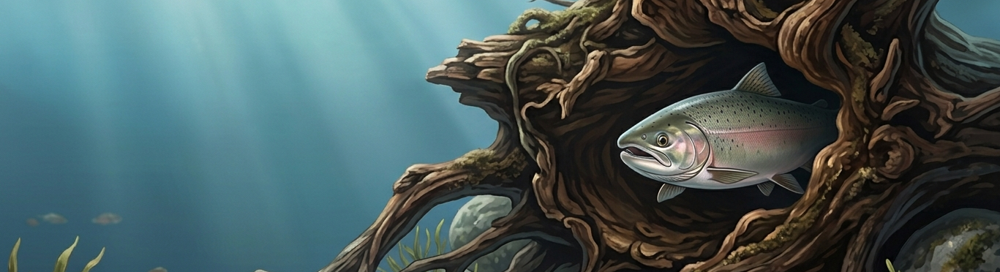

# Systematic literature review: salmon, cover, and habitat suitability

This repository contains code for a systematic literature analysis supporting a
paper on the role and influence of cover on salmonid behavior, with attention
paid to how cover is represented in habitat suitability indices (HSIs).

The workflow combines two independent full-text review datasets, reconciles and
cleans the review fields, standardizes key study attributes, and produces
derived tables and summary figures for the scientific manuscript.

## What the analysis does

The pipeline:

- documents the review workflow from database search through inclusion
- imports and merges reviewer datasets from `data-raw/`
- preserves a reviewer comparison table for traceability
- filters to the included studies
- standardizes species, lifestage, and location fields
- writes cleaned outputs to `data-derived/`
- saves summary plots to `figures/`

## Repository structure

- `run_analysis.R`: main entrypoint that runs the full pipeline
- `scripts/`: ordered analysis steps
- `R/`: reusable helper functions for import, cleaning, standardization, and plotting
- `data-raw/`: source review spreadsheets
- `data-derived/`: cleaned datasets, crosswalks, and summaries
- `figures/`: generated plots

## Running the analysis

This project uses `renv` for package management. From the project root:

```r
renv::restore()
source("run_analysis.R")
```

Or from the shell:

```sh
Rscript run_analysis.R
```

## Tests and CI

Basic repository checks can be run locally with:

```sh
Rscript --vanilla tests/run_tests.R
Rscript --vanilla scripts/check_renv_sync.R
```

The GitHub Actions workflow runs those checks, then executes the full analysis
and verifies that committed outputs under `data-derived/` and `figures/` are
still current.

## Review workflow

The review-process figure summarizes a database search for salmonid habitat
suitability literature, title and abstract screening for references to cover
and juvenile rearing life stages, and full-text screening for inclusion in the
final analysis. In the current workflow, 1,464 records were screened at the
title and abstract stage, 51 advanced to full-text review, and 27 were
included in the final analysis.

## Main outputs

Representative outputs include:

- `data-derived/reviewer_comparison.csv`
- `data-derived/papers_clean.csv`
- `data-derived/paper_species.csv`
- `data-derived/paper_lifestage.csv`
- `data-derived/paper_locations.csv`
- `data-derived/summary_review_process.csv`
- `data-derived/summary_*.csv`
- `figures/review_process.png`
- `figures/year_published.png`
- `figures/species.png`
- `figures/lifestage.png`
- `figures/location.png`

<p align="center">
  
</p>

*Illustration generated by Google Gemini Nano Banana 2.*
